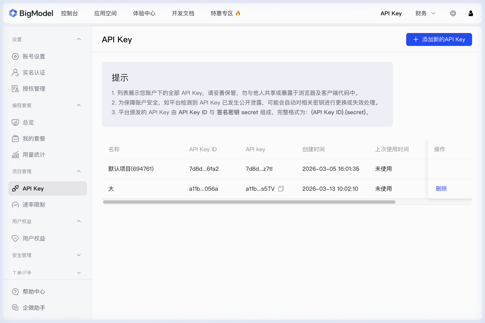
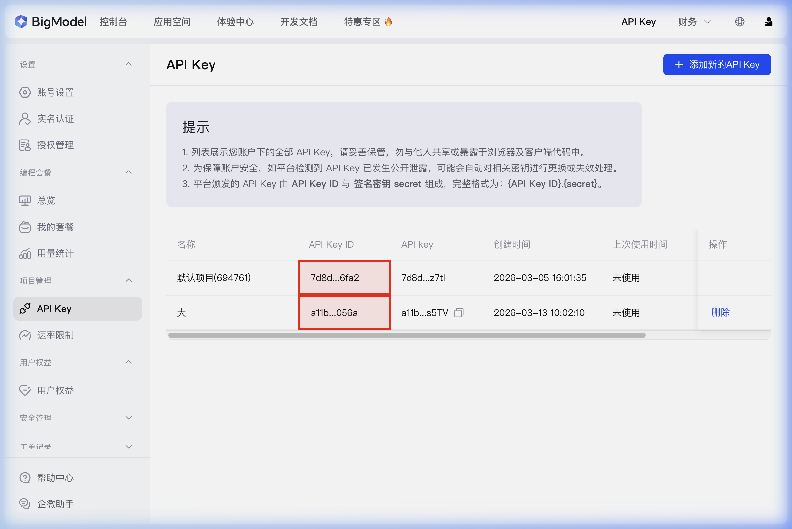
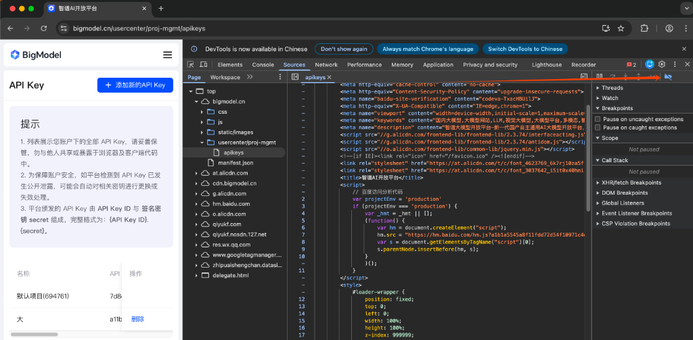
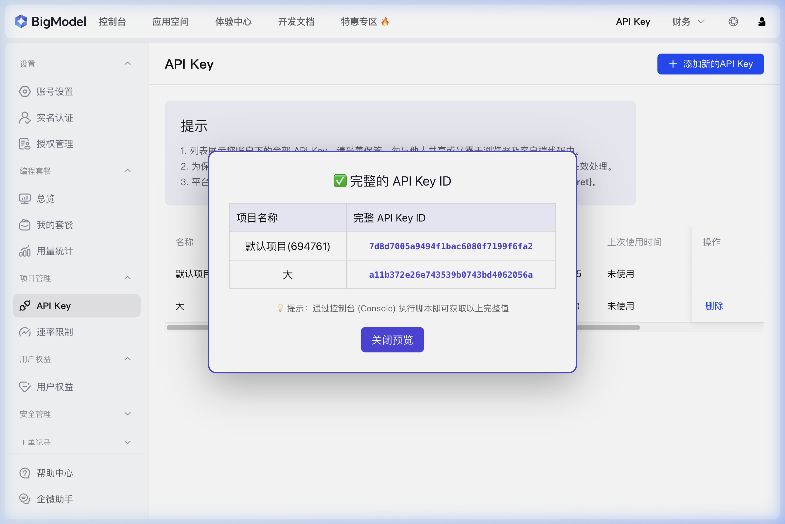

# 📖 智谱 AI (BigModel) 平台 — 获取完整 API Key ID 指引

> [!NOTE]
> 本指引适用于在 [智谱 AI 开放平台](https://bigmodel.cn) 上获取完整的 API Key ID。
> 页面上默认显示的 API Key ID 是**截断版本**（如 `7d8d...6fa2`），本文将教你如何获取**完整值**。

---

## 前置知识：API Key 的组成

根据平台说明，智谱 AI 的 API Key 由两部分组成：

```
完整 API Key = {API Key ID}.{签名密钥 secret}
```

| 组成部分 | 说明 | 示例（截断显示） |
|:---|:---|:---|
| **API Key ID** | 密钥的唯一标识符 | `7d8d...6fa2` |
| **签名密钥 secret** | 用于签名验证的密钥 | 隐藏不可见 |
| **API Key（完整）** | ID + secret 的组合 | `7d8d...z7tl` |

---

## 第一步：登录并进入 API Key 管理页面

1. 打开 Chrome 浏览器，访问 [https://bigmodel.cn](https://bigmodel.cn)
2. 使用手机号或微信扫码登录
3. 登录后，点击左侧菜单栏 **「项目管理」→「API Key」**

你将看到如下页面：



> [!IMPORTANT]
> 注意表格中的 **API Key ID** 列（下图红框标注位置），显示的是**截断后的值**，如 `7d8d...6fa2`，并非完整内容。

---

## 第二步：定位 API Key ID 所在位置

在表格中，**API Key ID** 位于第三列（如下图红框标注）：



表格列的含义：

| 列名 | 说明 |
|:---|:---|
| **名称** | 项目名称 |
| **API Key ID** | 密钥 ID（页面上截断显示）⬅️ **这就是我们要获取的** |
| **API Key** | 完整密钥（ID + secret 组合，也是截断显示） |
| **创建时间** | 密钥创建时间 |
| **上次使用时间** | 最后一次使用时间 |
| **操作** | 删除等操作按钮 |

---

## 第三步：获取完整 API Key ID

> [!TIP]
> **技术细节分析**：该平台页面不仅使用了 CSS 隐藏，还通过**前端逻辑（Vue 渲染）**对 DOM 中的文本进行了硬截断（物理上插入了 `...` 字符）。
> 因此，普通的 `textContent` 提取和「检查元素」方法**可能无法获取完整值**。我们需要通过浏览器底层数据来提取。

### 方法一：全自动兼容提取脚本（推荐 ⭐）

这是最精确的方法，脚本会自动探测页面中所有可能的 Vue 组件路径，直接读取内存中的原始数据，不受页面截断影响。

**操作步骤：**

1. 在 API Key 管理页面上，按下键盘 **`F12`** 键（或 Mac 上 **`Cmd + Option + I`**）打开开发者工具
2. 点击顶部的 **「Console」（控制台）** 标签页
3. 在控制台输入以下代码，然后按 **回车 (Enter)**：

```javascript
(function() {
    console.log("%c正在深度扫描 API Key 原始数据...", "color: #409EFF; font-weight: bold;");
    
    function extract() {
        // 定义多种可能的定位策略（兼容不同侧边栏状态和组件版本）
        const configs = [
            { selector: '.api-keys', key: 'apiKeyList' },
            { selector: '.el-table', key: 'tableData' },
            { selector: '.el-table__body', key: 'data' },
            { selector: '.ant-table', key: 'dataSource' }
        ];

        for (const config of configs) {
            const el = document.querySelector(config.selector);
            if (el && el.__vue__) {
                let data = el.__vue__[config.key];
                // 如果当前层级没有，查一下父级
                if (!data && el.__vue__.$parent) data = el.__vue__.$parent[config.key];
                if (!data && el.__vue__.$data) data = el.__vue__.$data[config.key];
                
                if (Array.isArray(data) && data.length > 0) return data;
            }
        }
        return null;
    }

    const rawData = extract();
    if (rawData) {
        console.log("%c✅ 提取成功！完整数据如下：", "color: #67C23A; font-weight: bold;");
        const formatted = rawData.map(item => ({
            "项目名称": item.name || "未命名",
            "完整 API Key ID": item.apiKey,
            "创建时间": item.createTime || "-"
        }));
        console.table(formatted);
        console.log("第一个项目的完整 ID: %c" + formatted[0]["完整 API Key ID"], "color: #E6A23C; font-size: 14px; font-weight: bold;");
    } else {
        console.error("❌ 未能探测到数据。请确保页面已加载出列表。");
    }
})();
```

4. 控制台将以表格形式输出**所有项目的完整 API Key ID**。

---

### 方法二：查看网络请求 (Network)

如果脚本失效，查看原始的网络响应是最稳妥的兜底方法。

**操作步骤：**

1. 打开开发者工具 (**F12**)，切换到 **「Network」（网络）** 标签页
2. **刷新页面** (F5)
3. 在顶部的筛选框中输入 `api_keys`
4. 点击名为 `api_keys` 的请求，选择 **「Preview」（预览）** 或 **「Response」（响应）**
5. 在 JSON 数据结构中找到 `apiKey` 字段，即为完整 ID。

---

## ⚡ 故障排查：开启 F12 刷新页面无法加载？

智谱 AI 平台设有“反调试”保护。如果你发现开启 F12 后按刷新（F5），页面一直卡在加载状态或断点处，请执行以下操作：

1.  切换到开发者工具顶部的 **「Sources」** (源代码) 标签页。
2.  在右侧边栏（或顶部工具栏）找到 **「Deactivate breakpoints」** 按钮（图标是一个带斜杠的暂停符号 🚫）。
3.  点击该按钮使其变亮（变为 **蓝色**），此时所有断点将被禁用。
4.  保持蓝色状态，再次按下 **F5** 刷新页面，页面即可正常加载。



---

## 获取结果展示

通过上述方法，成功获取到的完整 API Key ID 如下：



| 项目名称 | 完整 API Key ID |
|:---|:---|
| **默认项目(694761)** | `7d8d7005a9494f1bac6080f7199f6fa2` |
| **大** | `a11b372e26e743539b0743bd4062056a` |

---

## ⚠️ 安全注意事项

> [!CAUTION]
> API Key 是访问智谱 AI 服务的凭证，请务必注意以下安全事项：

1. **不要在公开代码库中暴露** API Key ID 或 API Key
2. **不要分享** 给他人或发布在公共平台
3. 如果密钥已泄露，请立即在管理页面 **删除** 该密钥并 **创建新的**
4. 使用 **环境变量** 或 **配置文件** 来管理密钥，不要硬编码在源代码中

```bash
# 推荐做法：使用环境变量存储 API Key
export ZHIPUAI_API_KEY="你的完整API_Key"
```

```python
# 在 Python 中通过环境变量读取
import os
api_key = os.environ.get("ZHIPUAI_API_KEY")
```

---

## 常见问题

### Q: API Key ID 和 API Key 有什么区别？
**A:** API Key ID 是密钥的标识符，API Key 是 `{API Key ID}.{secret}` 的组合。调用接口时通常使用**完整的 API Key**。

### Q: 我需要单独使用 API Key ID 吗？
**A:** 大多数情况下，你只需要使用 **API Key** 列的完整值即可调用接口。API Key ID 主要用于密钥管理和识别。

### Q: 为什么页面上要截断显示？
**A:** 这是一种安全措施。截断显示可以防止他人在你共享屏幕或截图时获取到完整的密钥信息。

### Q: 如何获取完整的 API Key（包含 secret）？
**A:** 在 API Key 列旁边有一个 📋 **复制图标**，点击即可将完整的 API Key 复制到剪贴板。你也可以使用上述控制台方法提取。

---

> 📅 文档创建时间：2026-03-13
